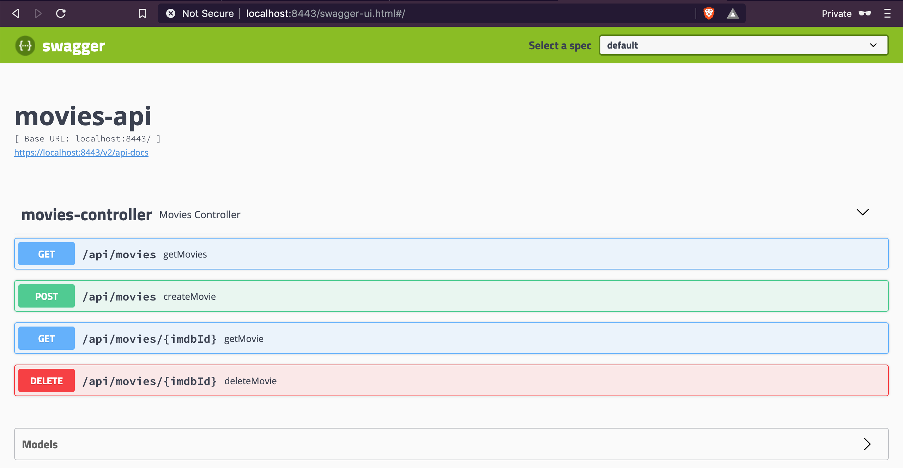
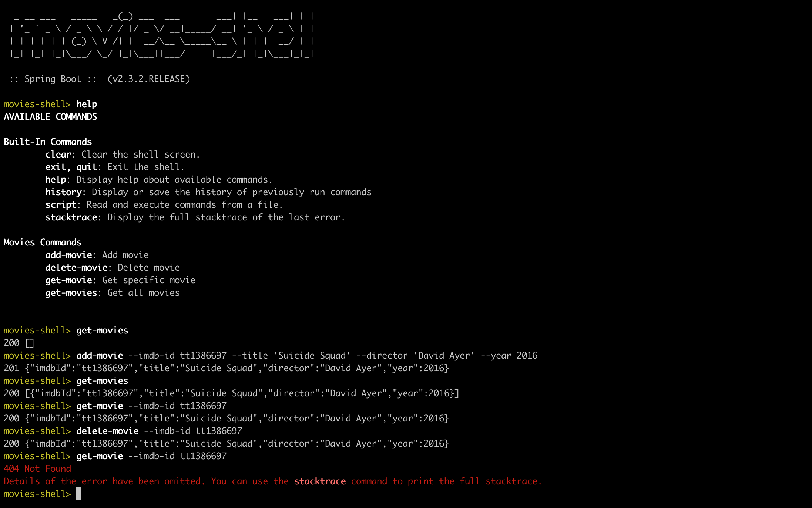
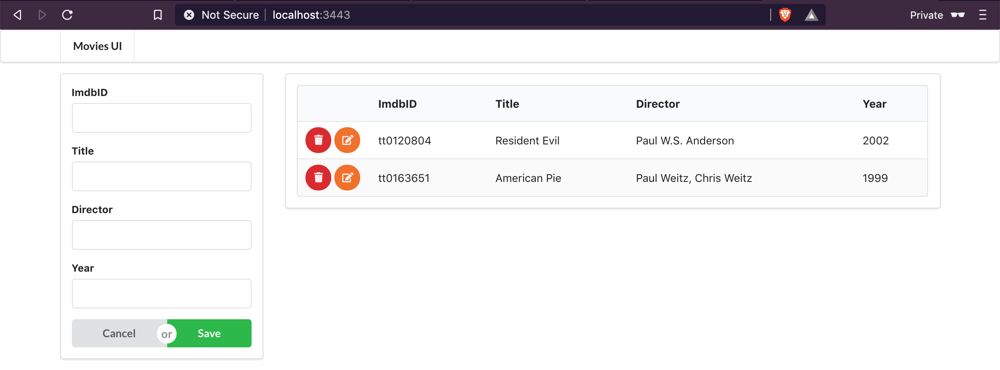

# `springboot-react-https`

The goal of this project is to play with [`HTTPS`](https://en.wikipedia.org/wiki/HTTPS) and enable it in [`Spring Boot`](https://spring.io/projects/spring-boot) applications. For it, we will implement a Spring Boot Rest API, called `movies-api` that will have its endpoints ready to accept and server over `HTTPS`. Furthermore, a Spring-Boot Shell Java application, called `movies-shell`, and a Frontend [ReactJS](https://reactjs.org/) application, called `movies-ui`, will be implemented to consume `movies-api`.

## Microservices

### movies-api

Spring Boot Java Web application that exposes a Rest API to manage movies. Its endpoints are ready to accept and server over `HTTPS`. `movies-api` stores its data in [`H2`](https://www.h2database.com/html/main.html) memory database.

### movies-shell

Spring Boot Shell Java application that uses `movies-api` to get information about a movie or to even create/delete a movie. All the communication with `movies-api` is over `HTTPS`.

### movies-ui

ReactJS frontend application where users can manage movies. All the communication with `movies-api` is over `HTTPS`. It uses [`Semantic UI React`](https://react.semantic-ui.com/) as CSS-styled framework.

## Start microservices

### movies-api

Open a terminal and inside `springboot-react-https/movies-api` folder run
```
./mvnw clean spring-boot:run
```

You can interact directly with `movies-api` through its Swagger website, https://localhost:8443/swagger-ui.html



### movies-shell

Open another terminal and inside `springboot-react-https/movies-shell` folder run the command below to package the `jar`
```
./mvnw clean package -DskipTests
```

Then, still inside `springboot-react-https/movies-shell`, run the following command to start `movies-shell`
```
./target/movies-shell-0.0.1-SNAPSHOT.jar
```

Sample of the shell interface and execution



### movies-ui

Open another terminal and inside `springboot-react-https/movies-ui` folder run
```
npm start
```

The url of `movies-ui` is https://localhost:3443



## Create PKCS12 self-signed certificate

In order to create a [`PKCS12`](https://en.wikipedia.org/wiki/PKCS_12) certificate, run the following command
```
keytool -genkeypair -alias localhost \
  -keyalg RSA -keysize 2048 -storetype PKCS12 \
  -keystore keystore.p12 -validity 3650 \
  -dname "CN=localhost, OU=MyCompany, O=MyCompany, L=Berlin, ST=Berlin, C=DE"
```

Set a password. In this project, we will use `secret`
```
Enter keystore password: secret
Re-enter new password: secret
```

To list the certificates `keystore.p12` run the command below. The password will be requested.
```
keytool -list -v -keystore keystore.p12
```

## References

- https://www.javadevjournal.com/spring-boot/spring-boot-ssl/
- https://www.baeldung.com/spring-boot-https-self-signed-certificate
- https://www.thomasvitale.com/https-spring-boot-ssl-certificate/