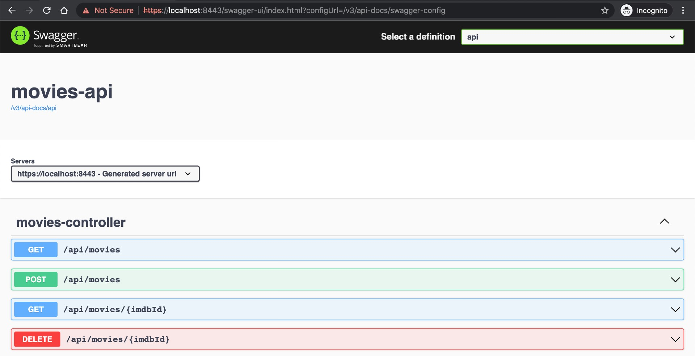
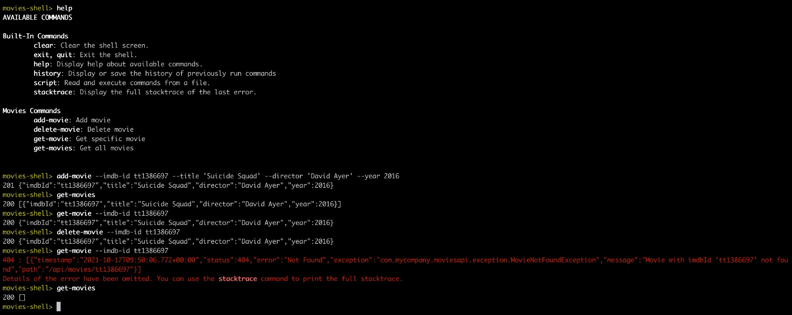
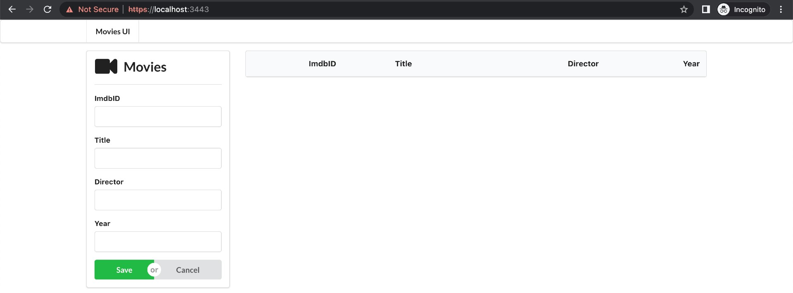

# https-springboot-react

The goal of this project is to play with [`HTTPS`](https://en.wikipedia.org/wiki/HTTPS) and enable it in [`Spring Boot`](https://docs.spring.io/spring-boot/index.html) applications. For it, we will implement a `Spring Boot` REST API, called `movies-api` that will have its endpoints ready to accept and server over `HTTPS`. Furthermore, a `Spring Boot Shell` Java application, called `movies-shell`, and a Frontend [`React`](https://react.dev/) application, called `movies-ui`, will be implemented to consume `movies-api`.

## Proof-of-Concepts & Articles

On [ivangfr.github.io](https://ivangfr.github.io), I have compiled my Proof-of-Concepts (PoCs) and articles. You can easily search for the technology you are interested in by using the filter. Who knows, perhaps I have already implemented a PoC or written an article about what you are looking for.

## Applications

- ### movies-api

  `Spring Boot` Web Java application that exposes a REST API to manage movies. Its endpoints are ready to accept and server over `HTTPS`. `movies-api` stores its data in [`H2`](https://www.h2database.com/html/main.html) memory database.

- ### movies-shell

  `Spring Boot` Shell Java application that uses `movies-api` to get information about a movie or to even add/delete a movie. All the communication with `movies-api` is over `HTTPS`.

- ### movies-ui

  `React` frontend application where users can manage movies. All the communication with `movies-api` is over `HTTPS`. It uses [`Semantic UI React`](https://react.semantic-ui.com/) as CSS-styled framework.

## Prerequisites

- [`npm`](https://docs.npmjs.com/downloading-and-installing-node-js-and-npm)
- [`Java 21+`](https://www.oracle.com/java/technologies/downloads/#java21)

## Start applications

- **movies-api**

  - Open a terminal and, inside the `https-springboot-react/movies-api` folder, run the command bellow:
    ```
    ./mvnw clean spring-boot:run
    ```

  - Access Swagger website at https://localhost:8443/swagger-ui.html

  - Once accessed for the first time, the following page will appear

    

  - Click `Advanced` > `Proceed to localhost (unsafe)`

    Now, you should see:

    
  
  - To re-enable the security warning saying `Your connection is not private` for `https://localhost:8443/swagger-ui.html`, click `Not Secure` (in the address bar) > `Re-enable warnings`

- **movies-shell**

  - Open a new terminal and navigate to the `https-springboot-react/movies-shell` folder
  
  - Run the command below to package the `jar`:
    ```
    ./mvnw clean package -DskipTests
    ```

  - Run the following command to start `movies-shell`:
    ```
    ./target/movies-shell-0.0.1-SNAPSHOT.jar
    ```

  - Sample of the shell interface and execution

    

- **movies-ui**

  - Open a new terminal and navigate to the `https-springboot-react/movies-ui` folder;

  - Execute the command below if you are running it for the first time:
    ```
    npm install
    ```

  - To start `movies-ui` run:
    ```
    npm start
    ```

  - Access https://localhost:3443

  - Once accessed for the first time, the following page will appear:

    

  - Click `Advanced` > `Proceed to localhost (unsafe)`

    Now, you shoud see:

    

    > **Note:** In case `movies-ui` cannot communicate with `movies-api`
    > - Open `movies-api` Swagger website: https://localhost:8443/swagger-ui.html
    > - Click `Advanced` > `Proceed to localhost (unsafe)`
    > - Reload `movies-ui` page
  
  - To re-enable the security warning saying `Your connection is not private` for `https://localhost:3443`, click `Not Secure` (in the address bar) > `Re-enable warnings`.

## Shutdown

To stop `movies-api`, `movies-ui` and `movies-shell`, go to the terminal where they are running and press `Ctrl+C`

## Create PKCS12 self-signed certificate

- In order to create a [`PKCS12`](https://en.wikipedia.org/wiki/PKCS_12) certificate, run the following command:
  ```
  keytool -genkeypair -alias localhost \
    -keyalg RSA -keysize 2048 -storetype PKCS12 \
    -keystore keystore.p12 -validity 3650 \
    -dname "CN=localhost, OU=MyCompany, O=MyCompany, L=Berlin, ST=Berlin, C=DE"
  ```

- Set a password. In this project, we will use `secret`:
  ```
  Enter keystore password: secret
  Re-enter new password: secret
  ```

- To list the certificates `keystore.p12` run the command below. The password will be requested:
  ```
  keytool -list -v -keystore keystore.p12
  ```

## How to upgrade movies-ui dependencies to latest version

- In a terminal, make sure you are inside the `https-springboot-react/movies-ui` folder

- Run the following commands:
  ```
  npm upgrade
  npm i -g npm-check-updates
  ncu -u
  npm install
  ```

## References

- https://www.javadevjournal.com/spring-boot/spring-boot-ssl/
- https://www.baeldung.com/spring-boot-https-self-signed-certificate
- https://www.thomasvitale.com/https-spring-boot-ssl-certificate/
- https://medium.com/@danielgwilson/https-and-create-react-app-3a30ed31c904